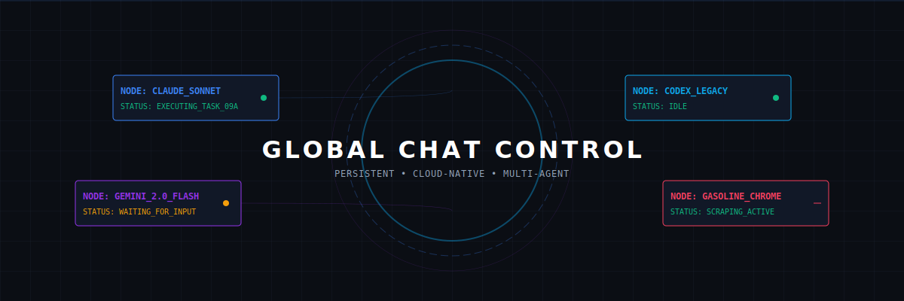

# 🤖 Global Chat Control

  

A cloud-native, persistent workspace for running multiple AI coding agents (Gemini, Claude, Codex) and UI-bound tools (Gasoline/Chrome) 24/7.

## 🚀 Why this exists
Local agent workflows stop when you close your laptop or lose internet. This project moves the entire execution layer to the cloud, giving you:
*   **Persistence:** Agents keep working while you sleep.
*   **Mobile Control:** Respond to agent prompts from your phone via a secure web terminal.
*   **Headless Chrome:** Run Gasoline/Chrome in a persistent virtual desktop for web scraping.
*   **Notifications:** Get a push notification on your phone the second an agent needs your input.

---

## 🏗️ Supported Providers
We provide Terraform configurations for the following clouds:
*   **[Oracle Cloud](./oracle)** (The "Always Free" King - 24GB RAM for $0)
*   **[DigitalOcean](./digitalocean)** (The Developer Favorite)
*   **[Hetzner](./hetzner)** (The Budget Choice)
*   **[Google Cloud (GCP)](./gcp)**
*   **[AWS](./aws)**

---

## 🛠️ Quick Start (3 Minutes)

1.  **[Device Setup](./setup-devices.md):** Ensure your laptop and phone are ready.
2.  **Choose a Provider:**
    `cd digitalocean` (or your preferred cloud)
3.  **Configure:**
    `cp terraform.tfvars.example terraform.tfvars`
    Open `terraform.tfvars` and fill in your API tokens, SSH key, and Tailscale key.
4.  **Deploy:**
    `terraform init`
    `terraform apply`
5.  **Access:**
    *   **IDE (VS Code):** `http://<tailscale-ip>:8080`
    *   **Headless Desktop (Chrome/Gasoline):** `http://<tailscale-ip>:3000`
    *   **Web Terminal (Mobile):** `http://<tailscale-ip>:7681`

---

## 📱 Notification Setup
Don't sit and watch a terminal. Set up a bridge to get notified on your phone:
*   **[Discord Setup (Recommended)](./setup-discord.md)** - Best for project organization and threading.
*   **[Telegram Setup](./setup-telegram.md)** - Lightweight and fast.
*   **[WhatsApp Setup](./setup-whatsapp.md)** - Using the CallMeBot bridge.
*   **[Signal Setup](./setup-signal.md)** - Private and self-hosted via Docker.
*   **[OpenClaw Setup](./setup-openclaw.md)** - Bidirectional ChatOps (Control agents via Chat).
*   **[⚡ ZeroClaw Setup](./setup-zeroclaw.md)** - The **Pro Pick**: Rust-based, ultra-lightweight ChatOps (<5MB RAM).
*   **[🏆 Senior Engineer's Pick](./SENIOR-ENGINEER-PICK.md)** - The lightest way to control agents (Zero-RAM ntfy Bridge).
*   **[ntfy.sh](https://ntfy.sh)** - The default bridge used in `cloud-init.yaml`.

---

## 🏗️ Architecture
All providers use a shared `cloud-init.yaml` that automatically installs:
*   **Tailscale:** Zero-trust private networking (no open ports).
*   **Docker:** Runs the WebTop/Chrome environment.
*   **ttyd:** Serves a secure terminal over the web.
*   **code-server:** VS Code in your browser.
*   **notify-agent:** A helper script to ping your phone from any CLI.
